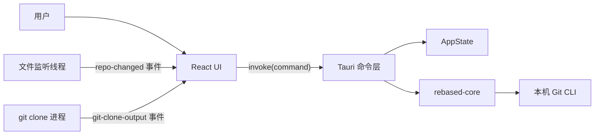
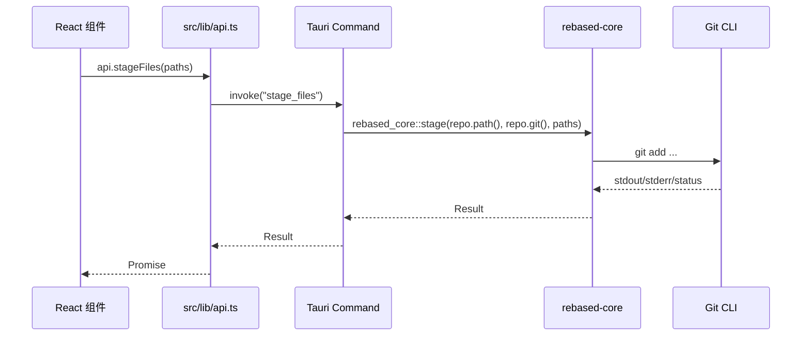

# 设计文档

## 总体架构

GitNest 由三层组成：

- 前端 UI：React、TypeScript、Zustand、TanStack Query、Tauri JS API。
- Tauri 后端：Rust 命令层、应用状态、文件监听、系统能力封装。
- Git 核心层：`crates/rebased-core`，封装 Git CLI 调用和 Git 数据结构。

关键文件：

- `src/main.tsx`：前端挂载入口，先应用默认深色主题，再立即渲染 React。
- `src/App.tsx`：应用根组件，负责 QueryClient、偏好设置、欢迎页和主布局切换。
- `src/lib/api.ts`：所有 Tauri invoke 的前端封装。
- `src/store/appStore.ts`：全局 UI 状态，例如当前仓库、工具窗口、编辑器标签。
- `src-tauri/src/lib.rs`：Tauri 后端初始化和命令注册。
- `src-tauri/src/state.rs`：后端共享状态。
- `src-tauri/src/commands`：后端命令模块。
- `crates/rebased-core`：Git CLI 和核心业务逻辑。

## 前端分层

### 应用启动

`src/main.tsx` 做两件事：

1. 调用 `applyTheme("dark")`，给窗口一个默认主题。
2. 立即渲染 `<App />`，随后异步读取用户设置并应用主题和语言。

这个设计避免等待后端设置读取完成后才显示界面。

### App 根组件

`src/App.tsx` 负责：

- 创建 `QueryClient`。
- 挂载 `PreferencesProvider`。
- 监听仓库变化事件。
- 注册全局快捷键。
- 根据 `useAppStore().repo` 判断展示 `WelcomePage` 还是 `MainLayout`。

`repo === null` 时显示欢迎页；打开仓库后，`setRepo` 会创建默认 `welcome-editor` 标签并进入主布局。

### 状态管理

全局 UI 状态在 `src/store/appStore.ts`：

- `repo`：当前打开的仓库。
- `leftToolWindow`、`leftPanelVisible`：左侧工具窗口。
- `commitTwTab`：Git 工具窗口内部 tab。
- `bottomToolWindow`、`bottomExpanded`：底部 Terminal/VCS Console 状态。
- `editorTabs`、`activeEditorTabId`：编辑器标签。
- `vcsConsoleOutput`：VCS Console 输出。
- `selectedRemote`：当前远端。
- `projectClipboard`：项目树复制/剪切状态。

TanStack Query 用于服务端数据缓存和刷新，例如 Git 状态、项目树、提交日志等。UI 状态和远端数据状态分开，避免把临时界面状态混入查询缓存。

### API 封装

`src/lib/api.ts` 是前后端通信边界。前端组件不直接写 `invoke("xxx")`，而是通过 `api.xxx()` 调用。

设计收益：

- 统一 TypeScript 返回类型。
- 命令名集中维护。
- 调整后端命令参数时更容易查找影响面。

新增后端命令时，应同步修改：

1. `src-tauri/src/commands/<module>.rs`
2. `src-tauri/src/commands/mod.rs`
3. `src-tauri/src/lib.rs` 的 `generate_handler!`
4. `src/lib/api.ts`
5. `src/lib/types.ts` 中必要的类型

## 后端分层

### Tauri 初始化

`src-tauri/src/lib.rs` 初始化：

- `tauri_plugin_dialog`
- `tauri_plugin_opener`
- `tauri_plugin_store`
- `tauri_plugin_updater`
- `AppState`
- 文件监听线程
- `ProcessStatsTracker`
- 全部 Tauri commands

注意：`tauri.conf.json` 中 updater **已开启**（`active: true`，`createUpdaterArtifacts: true`，公钥已配置）。构建与发版需提供 `TAURI_SIGNING_PRIVATE_KEY`；详见 [release.md](./release.md)。

### AppState

`src-tauri/src/state.rs` 保存后端共享状态：

- `repo: Mutex<Option<Repository>>`
- `settings: Mutex<AppSettings>`
- `clone_cancels: Mutex<HashMap<String, Arc<AtomicBool>>>`

常用方法：

- `with_repo`：要求当前有打开仓库，并把 `Repository` 传入闭包。
- `repo_path`：获取当前仓库路径。
- `add_recent_repo`：维护最近打开列表，最多 20 条。
- `clear_recent_repos`：清空最近打开列表。
- `settings_snapshot`：获取设置快照。

### 命令模块

`src-tauri/src/commands` 按功能拆分：

- `repo.rs`：打开、关闭、初始化仓库和新窗口。
- `status.rs`：status、stage、unstage、commit、discard、冲突解决。
- `diff.rs`：工作区、暂存区、提交、分支范围 diff。
- `log.rs`：提交日志和提交文件列表。
- `branch.rs`：分支列表、切换、创建、删除、变基、合并等。
- `remote.rs`：fetch、pull、push。
- `operations.rs`：merge、rebase、reset、revert、cherry-pick。
- `stash.rs`：stash 列表、push、pop、apply、drop。
- `project.rs`：项目树和文件系统操作。
- `preview.rs`：文件预览。
- `hosting.rs`：clone、remote/tag；GitHub/GitLab token 校验、PR/MR 列表与基础创建（`rebased-core` 的 `github.rs` / `gitlab.rs`）。
- `settings.rs`：设置和最近打开列表。
- `terminal.rs`：终端命令执行。
- `process.rs`：应用进程 CPU/内存统计。

## Git 操作流

多数 Git 操作遵循相同流转：

文件系统发生变化后，`watcher.rs` 会 debounce 并发送 `repo-changed` 事件，前端监听后刷新相关 Query。

## 文件监听

`src-tauri/src/watcher.rs` 在独立线程中运行：

- 周期性读取当前 `repo_path`。
- 仓库变化时更新 `notify` 监听路径。
- 对 create、modify、remove、any 事件发送 `repo-changed`。
- 使用 400ms debounce 避免频繁刷新。

这个线程不会阻塞 UI 启动。

## 项目树和编辑器

项目树相关后端命令在 `project.rs`：

- `list_project_entries`
- `list_project_tree`
- `create_project_file`
- `create_project_directory`
- `rename_project_entry`
- `move_project_entry`
- `copy_project_entry`
- `delete_project_entry`
- `read_text_file`
- `write_text_file`
- `get_project_absolute_path`

编辑器标签由 `appStore` 维护。当前标签类型：

- `diff`
- `log`
- `settings`
- `welcome`
- `branches`
- `file`

项目树点击普通文件时通过 `openFileEditor(path)` 打开 `file:<path>` 标签。`FileEditor` 读取文本内容后提供编辑和保存。

## Diff 和文件预览

Diff 和预览是两个相关但不同的能力：

- `DiffViewer` 用于展示 Git diff。
- `FilePreviewView` 用于展示文件内容、图片、二进制或删除状态。
- `highlight.ts` 使用 shiki 做语法高亮，但通过动态 `import("shiki")` 按需加载，避免增加首屏加载成本。

处理 Git 状态时要保留 `git status --porcelain` 的前导空格。不能对整段 stdout 做 `trim()` 后再解析，否则第一行的状态列会错位，可能把 `.gitignore` 错误解析为 `gitignore`。

## 克隆流程

`hosting.rs` 中 `git_clone` 是异步命令：

1. 为本次 clone 创建 `clone_id` 和取消标记。
2. 使用 `spawn_blocking` 执行 `git clone --progress`。
3. 分别读取 stdout 和 stderr。
4. 通过 `git-clone-output` 事件发送实时日志。
5. 如果用户取消，设置 `AtomicBool`，后端 kill 子进程并删除目标目录。
6. 结束后从 `clone_cancels` 移除标记。

## 发布和更新设计

`src-tauri/tauri.conf.json` 当前配置：

- `bundle.active: true`
- `bundle.targets: "all"`
- `bundle.createUpdaterArtifacts: true`
- `plugins.updater.active: true`
- updater endpoint：`https://github.com/OldCoffee/GitNest/releases/latest/download/latest.json`

CI：三平台正确性检查（`.github/workflows/ci.yml`）。发版：`v*` tag 触发 `.github/workflows/release.yml`（updater 签名；不做 Apple 公证 / Windows Authenticode）。私钥仅通过本机环境变量或 GitHub Actions Secrets 注入。
